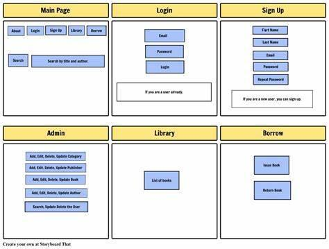
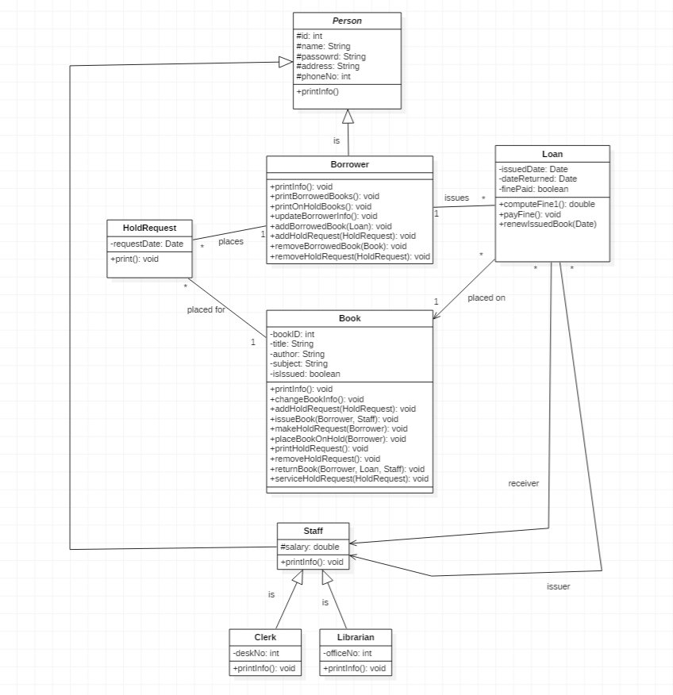

# Library Management System

- Android Application

## *Wireframe*

## *Class Diagram*

## *References*

### Tutorials

- [Setting up Android studio](https://youtu.be/InigFUSiPl8)
- [A Beginner's Guide to Android App Development - Udemy](https://www.udemy.com/course/a-beginners-guide-to-android-app-development/)
- [Android App Development - Coursera](https://www.coursera.org/learn/java-for-android/home/welcome)
- [Android Full Course - Youtube](https://youtu.be/aS__9RbCyHg)

### For layouts and more idea

- [Android Project On Library Management System](https://www.youtube.com/watch?v=TKum0Eg206c)
- [Simple Library Management App In Android + Firebase With Source code](https://www.youtube.com/watch?v=HCQPtRrPPcE)
- [Library Management System Android App](https://www.youtube.com/watch?v=B-CjB_dmQcw)
- [Library Management App | App development](https://www.youtube.com/watch?v=HxUVoF0IfP4)

### Color Coordination

- [Color palettes](https://coolors.co/palettes/trending)
- [Color Tool](https://material.io/resources/color/#!/?view.left=0&view.right=0)

### Further references

- [Library Management System](https://github.com/OSSpk/Library-Management-System-JAVA)
- [Library Management System](https://github.com/yliu12138/Android-Library-Management-System)

#### Login page - Resources

- [Login & Register Android App Using Firebase](https://www.youtube.com/watch?v=tbh9YaWPKKs)
- [Login via Google](https://www.youtube.com/watch?v=E1eqRNTZqDM)
- [Login via Phone - 1](https://www.youtube.com/watch?v=w3Dg8LTmtTo)
- [Login via Phone - 2](https://www.youtube.com/watch?v=YhCKylWLnq0)

Without Authentication, just UI.

- [Create beautiful login screen | Android Studio Tutorial - Without Authentication](https://www.youtube.com/watch?v=GAdGmJxfcf8)
- [Attractive - Splash Screen and Login Screen with Animation in Android Studio](https://www.youtube.com/watch?v=-7xLyPLJ_NI)
- [Login Screen UI Design - Adobe XD to Android Studio XML](https://www.youtube.com/watch?v=IVE5ETGEoA4)

## TODO (till Friday) - 4 pages

- **Home page Page** - Kavya
  - LMS (logo)
  - About details
- **Bottom Navbar**
  - Home 
  - **Library**
    - books (Offline / **PDF - (sem --> subject wise)**)
      - <kbd>issue book</kbd>
  - **Profile Page** - Parth
  - **Login page** - FireBase - Tushar

##
  
- Profile page
If registered and logged in:
  - Personal
  - Transaction
    - Borrow history
    - Due dates
If not registered:
  - Registration form (via Phone/Google)
