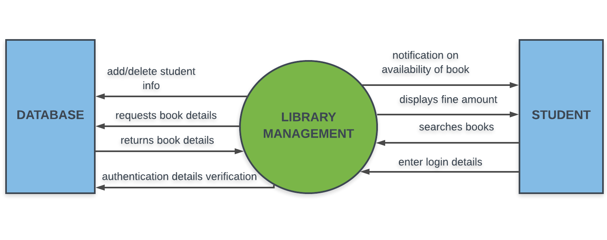
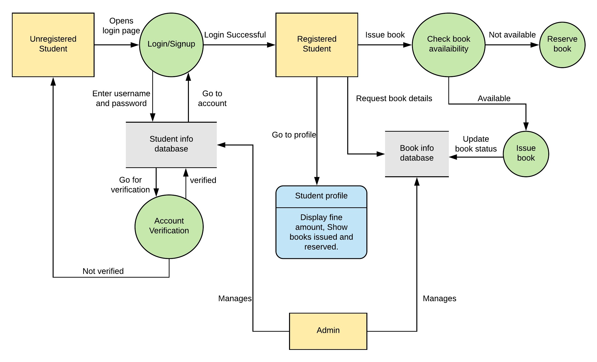
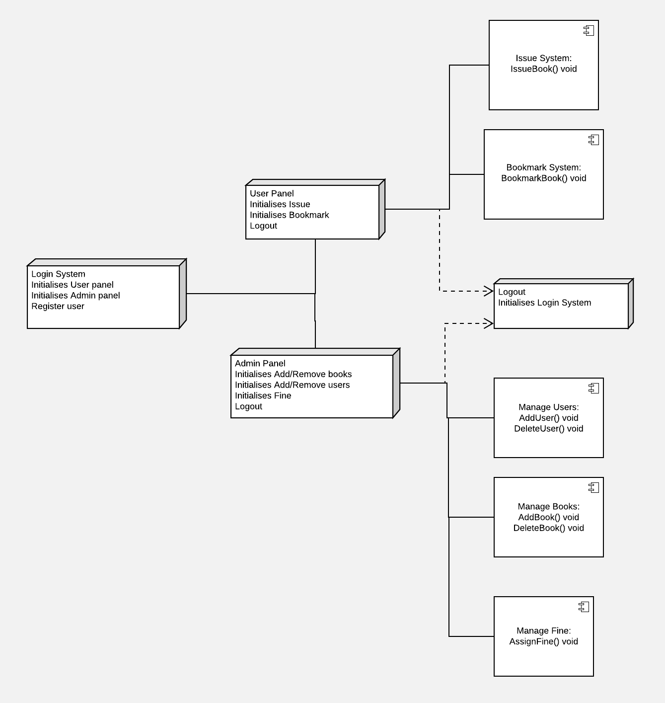

# *Documnetation*

## *Context Diagram*

The library management app has a main entity as the library mangement system itself and
two entities/actors called the database and student. The above context diagram establishes
relationship between the system, the student and the database.

The student enters login details and the system searches the database for verification.
Once the student details are verified the student can request the system to search for
particular book and the system in turn requests the database to return the book details.
Also the student upon logging in can see the current fine.

The admin who can access the system can add/delete book as well as student information
to the database.

The system also has the feature to notify the student as soon as a particular book which the
user has requested earlier becomes available.

## *Data Flow Diagram*

## *Deployment Diagram*

